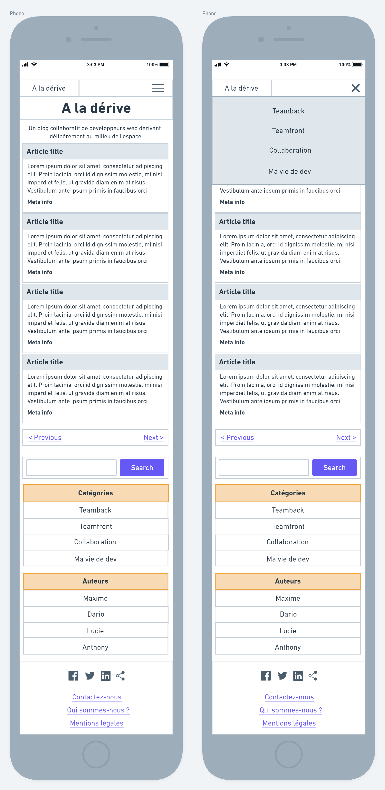
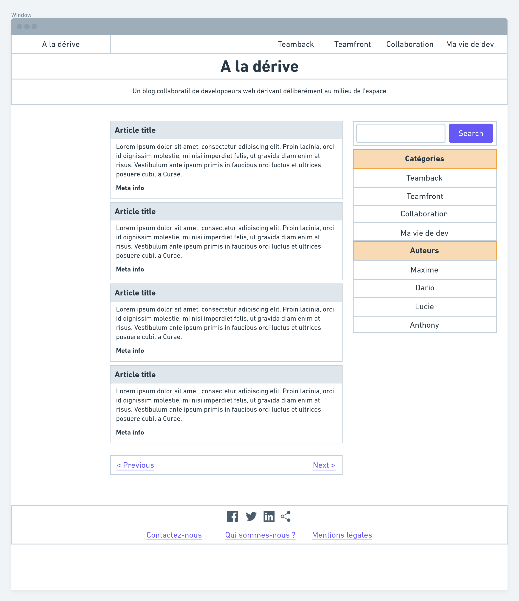

# ☺️ Blog Project ☺️

The objective is to implement the homepage integration of our client's blog. 

Notions of the day

- Project management
- Specifications document
- Project tracking using Trello
- Wireframes
- CSS framework using Bootstrap

## Table of contents

- [The challenge](#the-challenge)
- [My process](#my-process)

## The challenge : 

### Intégration des maquettes

Using the provided wireframes, we'll have to **create a basic HTML/CSS integration** of the homepage using Bootstrap.

The tasks include:

* Analyzing the provided documents to support our work. The **wireframes** will be particularly helpful, but the **Specifications Document (CDC)** can also provide guidance!
* Considering *mobile-first* and *responsive design*.
* Building the HTML structure of the homepage (without pagination links or footer icons).
* Using Bootstrap and its components to create an initial integration. Ideally, *no custom CSS* should be used, only Bootstrap, to establish a *working foundation* for the rest of the integration.

### Bonus

* Adding pagination below the article list using the **Pagination** component.
* Adding social media icons in the footer.
* If we cannot find the exact same icons, it's important that they represent the same concepts as shown in the wireframes !

### Resources

### Specifications Document

[We can find the Specifications Document here](cdc/cdc-blog.md)! Make good use of it.

### Wireframes

## My process :

<strong>Built with </strong>
- VSC 
- HTML
- BootStrap