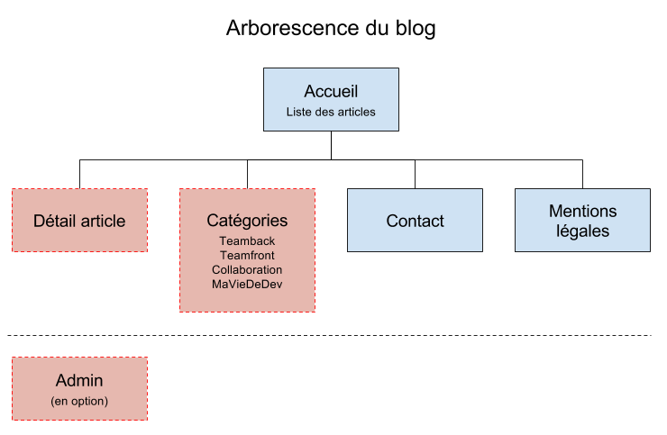

# Project Blog Specifications

## Context

### Presentation / Initial Proposal

Project name proposal: blog.  
Within a web development school, a Training Manager wishes to provide students with access to an *internal blog*.

### Objective / Contextualization

The objective of the project is to make available a "developers' blog" so that students who wish to can share their training journey. It is a standard blog project from a technical standpoint, with the particularity that the intended purpose is primarily educational (writing and sharing articles internally within the school) :nerd_face:

### Budget

Starting from €2000 excluding taxes (equivalent to 5 [person-days](https://en.wiktionary.org/wiki/person-day) at an average daily rate of €400). The budget is allocated to the following items:

- Project management (study, specifications, wireframes, follow-up)
- Creation of original graphic mockups
- HTML/CSS integration
- Blog development
- Testing and deployment (MEP)

### Deadline

Two weeks from the validation of the quote (accompanied by a 30% deposit).

## Functional Specifications

### Appearance

- "Space" ambiance (cosmos).
- Responsive website, *mobile-first*.

### Content

- Articles
- Article authors
- Article categories (already known: Front, Back, Collaboration, Dev Life).

The content will be created *eventually* through an administration interface (to be included as an option in the quote: initially, the content will be provided for manual integration — maintenance service to be considered in the quote).

### Service Interactions

- Links and/or sharing to social networks.

### Language(s)

In French only.

### Tree Structure

- Home
- Category page (articles filtered by category):
  - Teamback
  - Teamfront
  - Collaboration
  - MyDevLife
- Article page (detail)
- (Contact)
- (Legal Notice)
- (Admin)

### Blog Navigation

- A main menu (*responsive*) for categories and home.
  - Small screens: a "burger" menu containing the links.
  - Otherwise: visible list of links.
- Clicking on the title or text excerpt of an article displays the full content.
- Clicking on a category navigates to a page listing all articles in that category.
- A secondary menu (in the footer or elsewhere) for linking to Contact, Legal Notice & Admin.

### Templates / Graphic Design

#### Global Layout

- A menu with:
  - Title/logo
  - Links to categories
- A header image with title + slogan (baseline)
- Right sidebar grouping:
  - Search field
  - List of categories
  - List of authors
- Footer:
  - Links to social networks
  - Links to admin, contact, legal notice

#### Article List

- The homepage lists the latest articles (exact number to be determined).
- Pagination "Previous" and "Next".
- An article presents:
  - A clickable title
  - A clickable summary
  - A date
  - An author
  - A category

### Technical Constraints

- Responsive website using *mobile-first* approach.
- Compatibility only with the latest versions of browsers (Chrome, Firefox, Microsoft Internet Explorer 11, and Edge).

## Technical Specifications

### Chosen Software Architecture

The blog will be designed with:

#### Front-end

- HTML5: the code will adhere to proper semantics.
- CSS: version 2 or 3, to remain compatible with Internet Explorer 11. The use of a framework for *responsive*/*mobile-first* is being considered.
- JavaScript: will be used if necessary but sparingly (no blocking features).

#### Back-end

- PHP: PHP7 will be used, along with the `PDO` class for accessing MySQL data.
- MySQL: will be used to store and persist data.

### Description of Data

- Articles
  - Title
  - Summary
  - Publication date
  - Number of views
  - Article author
  - Category to which the article belongs
- Authors
  - Last name
  - First name
  - Profile image
- Categories
  - Title
